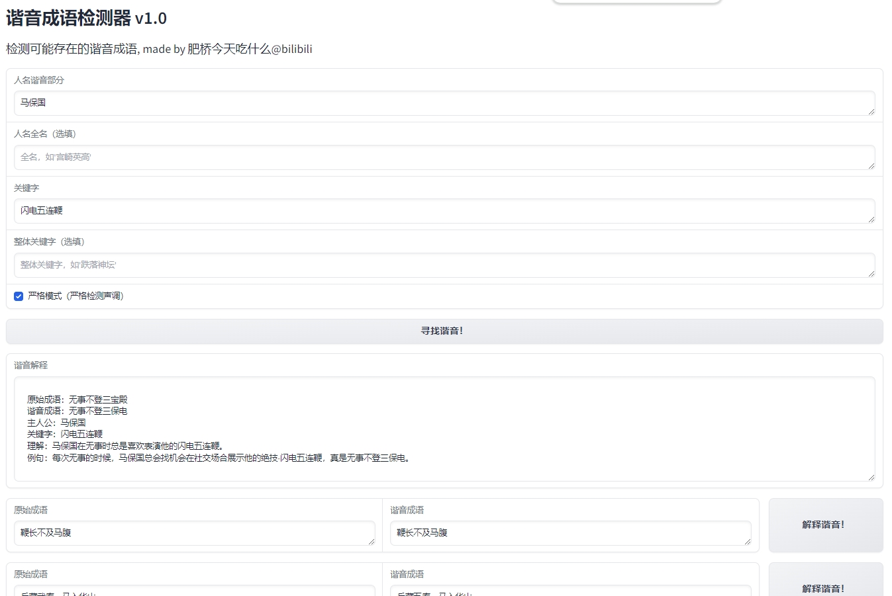

# Homophone Detection Tool v1.0

<a href="README.md">中文</a> &nbsp ｜ &nbspEnglish&nbsp

Detect potential homophone idioms based on an idiom database and use the capabilities of large language models to provide explanations.

## Introduction
Establish a dataset of idioms from the Xinhua Dictionary. 
Special thanks to pwxcoo/chinese-xinhua for the idiom collection file! 
Automatically search for potential homophone results based on user input of names and keywords. 

## Usage
Name: The subject of the homophonic name.  
Full Name (Optional): The full name, used for understanding the homophonic part more precisely. This is set up because there might be parts of the full name that should not be included in the homophonic interpretation.  
Keyword: The subject of the homophonic keyword.  
Full Keyword (Optional): The full form of the keyword, following a similar idea to the full name setup.  
Strict Mode: Whether to strictly detect tone. If yes, only results with exactly the same tones will be returned. If no, results with the same pinyin will be returned. 

